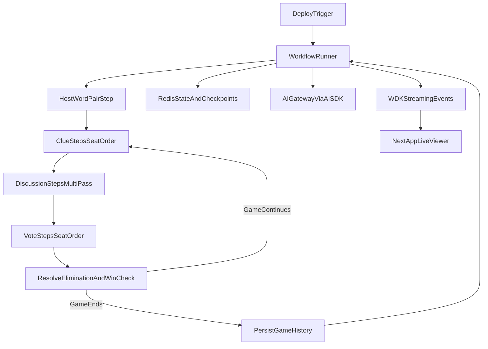

# AI Impostor — Extended Implementation Spec

This document translates `SPEC.md` into an execution-ready delivery plan with phases, checkpoints, and quality gates.

## Product Goal

Build an always-on spectator experience where 6 AI players (4 Civilians, 1 Impostor, 1 Mr. White) play continuously, with:

- Durable workflow execution and crash-resume at exact step boundaries
- Live token/step streaming to the UI
- Reliable step retries for model/provider failures
- Full game history persisted in Redis

## Product/UX Reference

Reference inspiration: `https://v0-chess-match.vercel.app/`

How we will use it:

- Match the "watch-it-live" spectator feel: high signal, low clutter, clear turn ownership.
- Prioritize real-time narrative readability (what happened, who acted, why outcome changed).
- Emphasize polished motion/transition cues between phases (clue, discussion, vote, elimination).
- Keep current game context and history visible without forcing navigation.

Checkpoint:

- A UI acceptance pass confirms the app feels comparable in clarity/liveness to the reference while preserving our game-specific information architecture.

Design intent for this project:

- Spectator-first layout: current action is always obvious
- Clear turn ownership: highlight active seat and phase
- Smooth narrative progression across clue/discussion/vote/elimination
- Persistent context: live game + recent history visible together

## Delivery Strategy

Ship in vertical slices so correctness and durability are locked before polish:

- Slice A: Contracts + deterministic game engine
- Slice B: Durable workflow + step persistence/retries
- Slice C: AI model integration + prompt/output contracts
- Slice D: Live UI/streaming + reliability hardening

## Phase 0 — Foundations and Contracts

Goal: define types, state contracts, and environment contracts.

Steps:

- Define core types (roles, seats, rounds, votes, eliminations, outcomes).
- Define canonical game state and append-only event schema.
- Add `.env.example` for AI Gateway, Upstash, and workflow config.
- Add required dependencies: WDK, AI SDK, Upstash Redis.

Checkpoint:

- Type contracts compile and are used by tests/stubs.
- Missing env configuration fails fast with clear errors.

## Phase 1 — Deterministic Game Engine (No AI)

Goal: validate game rules independently from model behavior.

Steps:

- Implement pure state transitions:
  - setup and role assignment (4/1/1)
  - clue phase
  - discussion phase (multi-pass)
  - vote collection/resolution
  - elimination + role reveal
  - Mr. White final guess
  - win-condition evaluation
- Implement tie handling (`no elimination -> next round`).
- Skip eliminated players while preserving fixed seat order.
- Add seeded RNG for reproducible game simulations.
- Add tests for all edge cases and win-condition branches.

Checkpoint:

- Deterministic simulation reaches valid terminal outcomes.
- Tests cover all branches in rules/win logic.

## Phase 2 — Durable Workflow Orchestration

Goal: map engine transitions to durable, retryable workflow steps.

Steps:

- Create main workflow entrypoint with `"use workflow"`.
- Isolate model actions into `"use step"` boundaries:
  - host word-pair generation
  - per-seat clue
  - per-seat discussion turns
  - per-seat voting
  - Mr. White final guess step
- Persist snapshot/checkpoint after each step in Redis.
- Add per-step retry/backoff policies.
- Implement infinite orchestration loop (`game end -> next game`).

Checkpoint:

- Forced crash mid-round resumes from exact interrupted step.
- Transient model/provider failures recover through retry path.

## Phase 3 — AI Layer (Gateway + Prompts + Validation)

Goal: connect host + six player models through AI Gateway safely.

Steps:

- Build model registry with one distinct model per seat + host model.
- Implement prompts for:
  - host word-pair generation
  - civilian clue/discussion/vote behavior
  - impostor related-word deception behavior
  - Mr. White unknown-word bluff and final guess behavior
- Validate outputs (shape and semantics) for each action type.
- Add guardrails/fallbacks for malformed responses.

Checkpoint:

- End-to-end dry run yields valid clue/discussion/vote actions.
- Invalid outputs are recovered without deadlock/corruption.

## Phase 4 — Realtime UX and Streaming

Goal: make every step legible and compelling to watch live.

Steps:

- Replace scaffold page with a live game viewer:
  - seat list/ring with active seat highlighting
  - phase indicator and round progress
  - discussion/event timeline
  - vote outcome and elimination reveal panels
- Stream thinking tokens and step updates via WDK streaming.
- Render history panel from Redis for recent completed games.
- Add UX pass inspired by reference app:
  - smooth phase transitions
  - concise, high-signal event formatting
  - strong hierarchy around "what is happening now"

Checkpoint:

- UI reflects in-progress steps in real time.
- Viewer can follow full game flow without ambiguity.
- UX review confirms responsiveness/readability quality target.

## Phase 5 — Reliability, Operations, and Deploy

Goal: production-safe continuous runtime on Vercel.

Steps:

- Add startup trigger route/bootstrap for exactly one loop initiator.
- Add singleton guard/idempotency lock in Redis.
- Add structured logs and core metrics:
  - game/workflow IDs
  - step latency and error counts
  - retry counts and terminal outcomes
- Add runbook in `README.md` for setup, deploy, and recovery.

Checkpoint:

- Deploy starts loop automatically and only once.
- Redeploy/restart does not create duplicate orchestrators.

## Quality Gates (Cross-Phase)

- Rule correctness gate: engine tests green before AI integration.
- Durability gate: crash-resume test green before infinite loop.
- Streaming gate: every state transition emits UI-consumable events.
- Safety gate: malformed output/provider-outage scenarios covered.

## Target File Map (Planned)

- `lib/game/types.ts`
- `lib/game/engine.ts`
- `lib/game/engine.test.ts`
- `lib/ai/models.ts`
- `lib/ai/prompts.ts`
- `lib/storage/redis.ts`
- `workflows/game-loop.ts`
- `app/api/workflows/start/route.ts`
- `app/page.tsx`
- `.env.example`

## Architecture (Target)

